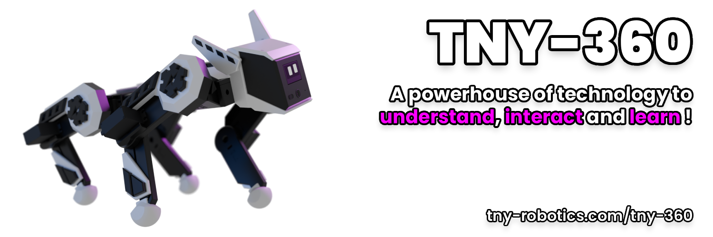

# TNY-360 Modified — by Fuffel

**A modified fork of the TNY-360 open-source quadruped robot.**  
**Goal: Transform T360 into an autonomous scout & rescue platform.**

[🌐 Original Project](https://tny-robotics.com/tny-360) • [📖 Original Docs](https://tny-robotics.com/docs/tny-360/) • [💬 Discord](https://discord.gg/XGABkx5A4y) • [👤 FurWaz / Paul Loisil](https://instagram.com/furwaz_)

---

## ⚠️ This is a Fork

This repository is a **personal modification** of the original [TNY-360 by Paul Loisil / FurWaz (TNY Robotics)](https://github.com/TNY-Robotics/TNY-360).

All credit for the original robot design, firmware architecture, electronics, and documentation goes to **Paul Loisil and the TNY Robotics team**.  
This fork documents my own modifications and extensions on top of their work.

---

## 🔧 My Modifications

🚧 In Progress

USB Serial Dashboard Transport (SerialTransport.hpp/.cpp)
Access the robot dashboard over USB instead of WiFi only.
Desktop Dashboard App
A desktop application wrapping the existing WebPortal dashboard, with a switchable connection mode — WiFi (WebSocket, same as today) or USB Serial (no need to swap WiFi networks).

📋 Planned

Active Cooling
-2x 30x30mm 12V fans mounted on the top cover.
  One intake (cold air in), one exhaust (warm air out) — airflow across the Buck Converter and PCBs.
  New top cover design with fan cutouts (OpenSCAD, replacing the logo cover).
- Arduino I2C Sensor Integration
  Arduino Uno as I2C sensor node (LiDAR data), feeding into the TNY-360 mainboard via the dorsal expansion port.
  Later upgrade: Arduino Uno Q (Linux + MCU) for on-device AI processing.
- LiDAR + Thermal Camera Expansion
  For autonomous navigation (SLAM) and person detection
- Autonomous Navigation (SLAM)
  Path planning + obstacle avoidance using LiDAR data.
  Target: Arduino Uno Q running ROS2 / Nav2 as master, TNY-360 mainboard as movement slave.
- Reinforcement Learning Gait
  Teaching T360 to walk using AI instead of pre-programmed gaits.

---

## 🚀 Getting Started

For building and assembling the base robot, **follow the original guide:**

> ### **[👉 Original Step-by-Step Guide by TNY Robotics 👈](https://tny-robotics.com/docs/tny-360/practical-guide/sourcing)**

For my modifications, see the relevant folders and their own READMEs:
- `Firmware/src/network/SerialTransport.cpp` — USB Serial Transport
- `CAD/cooling/` — Fan cover OpenSCAD files *(coming soon)*

---

## ⚙️ Original Hardware Specs

*(Unchanged from original — see [TNY Robotics documentation](https://tny-robotics.com/docs/tny-360/) for full details)*

| Component | Spec |
|---|---|
| MCU | ESP32-S3 N16R8 |
| Power | 3S LiPo (6x Samsung INR18650-25R) |
| Legs | 12x MG996R (modified with Op-Amp feedback PCB) |
| Head | 2x SG-90 Micro Servos |
| Vision | OV2640 Camera |
| Distance | VL53L0X ToF LiDAR |
| IMU | MPU6050 |
| Display | SH1106 OLED |
| Audio | I2S MEMS Mic + Speaker |

---

## 📂 Repository Structure

- `BOM/` — Bill of Materials (original)
- `CAD/` — Hardware files (original + my additions in `CAD/cooling/`)
- `Electronics/PCBs/` — PCB Designs (original)
- `Firmware/` — Codebase with my modifications on top of the original
- `Firmware/src/network/SerialTransport.cpp` — USB Serial Transport (my addition)

---

## 📄 License & Credits

**Original TNY-360** by [Paul Loisil / FurWaz](https://instagram.com/furwaz_) — [TNY Robotics](https://tny-robotics.com)  
**This fork** by Fuffel (Felix Brehm)

Licensed under **CC BY-NC-SA 4.0** — non-commercial use, attribution required, share alike.

